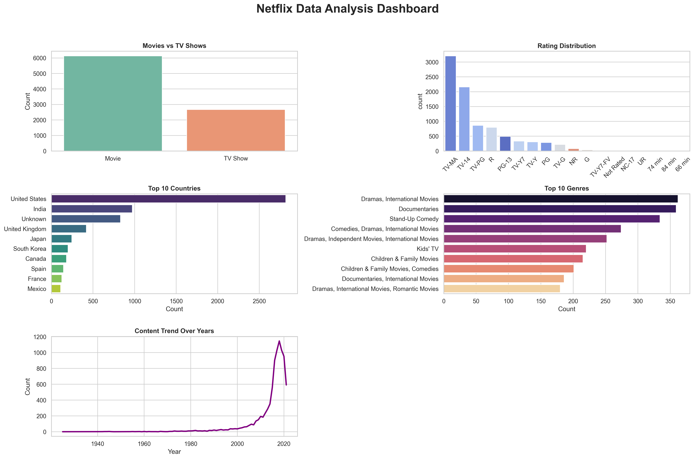

# PRODIGY_DS_02
# 🎬 Netflix Data Analysis Dashboard  
## Task 2 - Prodigy InfoTech Data Science Internship

---

## 📌 Project Overview

This project was completed as part of my **Data Science Internship at Prodigy InfoTech**.

The objective of this task was to perform **Data Cleaning** and **Exploratory Data Analysis (EDA)** on a real-world dataset to identify trends, patterns, and relationships between variables.

For this project, I used the **Netflix Movies and TV Shows Dataset**.

---

## 📂 Dataset Information

The dataset contains information related to Netflix content such as:

- Title  
- Type (Movie / TV Show)  
- Country  
- Release Year  
- Rating  
- Genre  
- Duration  

---

## 🧹 Data Cleaning Performed

✔ Checked missing values  
✔ Filled null values in important columns  
✔ Removed duplicate records  
✔ Prepared dataset for analysis  

---

## 📊 Dashboard Preview



---

## 📈 Exploratory Data Analysis (EDA)

The dashboard includes the following visualizations:

1. Movies vs TV Shows Distribution  
2. Rating Distribution  
3. Top 10 Countries Producing Content  
4. Top 10 Genres on Netflix  
5. Content Trend Over Years  

---

## 💡 Key Insights

- Netflix has more **Movies** than TV Shows.  
- The **United States** and **India** are among the top content-producing countries.  
- Content production increased significantly after **2015**.  
- Drama and International categories are highly common.  
- Most content is rated **TV-MA** and **TV-14**.  

---

## 🛠️ Tools & Technologies Used

- Python  
- Pandas  
- NumPy  
- Matplotlib  
- Seaborn  
- Jupyter Notebook  

---

## 📁 Repository Structure

```text
PRODIGY_DS_02/
│── data/
│   └── netflix_titles.csv
│── images/
│   └── netflix_dashboard.png
│── task2_eda.ipynb
│── README.md
